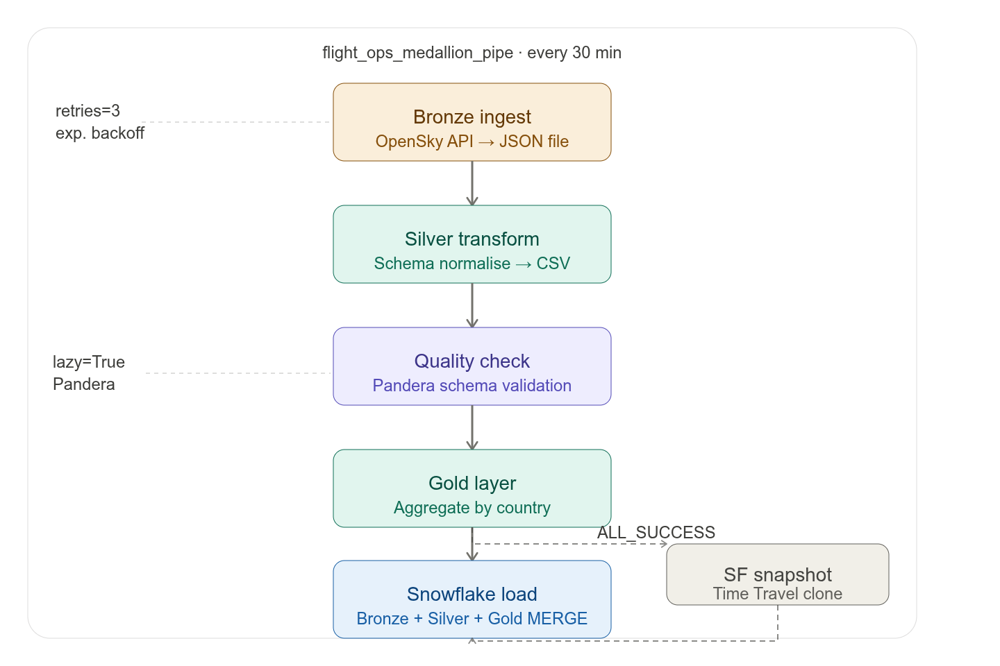

# Air Flight

End-to-end flight data engineering pipeline using Apache Airflow, Snowflake, and Docker.

This repository contains Airflow DAGs, helper scripts, and configuration to ingest, transform,
and load flight telemetry into a data warehouse. It is intended as a local development
and demonstration environment.

**Key Features:**
- Orchestrated ingestion, transformation, loading, and quality checks (Airflow DAGs)
- Bronze / Silver / Gold layering in `data/` and supporting dbt files in `dbt/`
- Docker Compose setup for running Airflow locally

**Repository layout (important paths):**
- `dags/` - Airflow DAGs (`ingest.py`, `transform.py`, `load.py`, `data_quality.py`)
- `data/` - Bronze / Silver / Gold sample data
- `scripts/` - helper scripts and quality checks
- `dbt/` - dbt project for downstream transformations
- `tests/` - unit and integration tests
- `requirements.txt`, `docker-compose.yml`, `Dockerfile`, `config.py`

Prerequisites
-------------
- Docker and Docker Compose
- Python 3.9+ (for local CLI tasks and running tests)

Quickstart (development)
------------------------
1. Clone the repository:

   ```
   git clone https://github.com/manoje8/air-flight.git
   cd airflow_flight
   ```

2. (Optional) Create and activate a virtual environment:

   ```
   python -m venv .venv
   source .venv/bin/activate
   ```

3. Install Python dependencies (optional for local scripts/tests):

   ```
    pip install -r requirements.txt
   ```

4. Start the local Airflow stack with Docker Compose:

   ```
    docker-compose up -d
   ```

5. Open the Airflow web UI: http://localhost:8080

   Default development credentials (if using the included compose setup): `admin` / `admin`

Tips
----
- DAGs live in `dags/` - changes are picked up by the Airflow scheduler.
- Sample raw JSON files are in `data/bronze/` for quick ingestion tests.
- Database / warehouse credentials should be provided via environment variables or
  your local `.env` file; sensitive credentials must NOT be committed.

Running tests
-------------
- Run unit tests:
```
  pytest tests/unit
```

- Integration tests (manual):
  - Start the stack with `docker-compose up -d`
  - Trigger DAG runs from the Airflow UI and inspect logs in `logs/`

Stopping and cleanup
--------------------
```
  docker-compose down
```

Where to look next
------------------
- DAG definitions: `dags/ingest.py`, `dags/transform.py`, `dags/load.py`
- Helper scripts: `scripts/` (quality checks, Snowflake helpers)

If you'd like, I can:
- run the unit tests locally and fix any failures,
- or open a PR with this README update.


