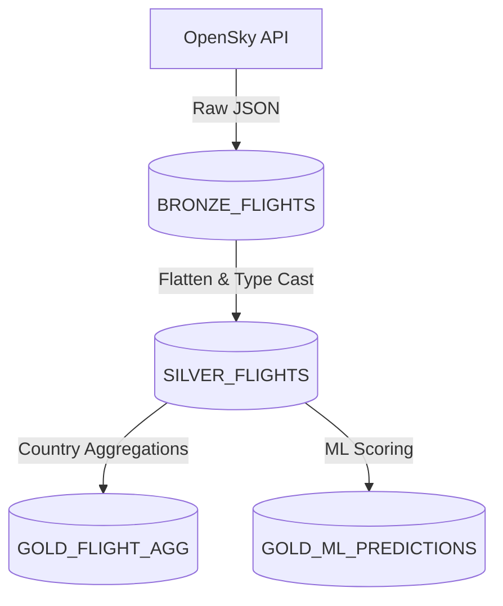

# Snowflake Schema Documentation

## Database and Schema Configuration
- **Database:** `FLIGHTS` *(or defined dynamically via environment configuration)*
- **Schema:** `FLIGHT_SCHEMA` *(or defined dynamically via environment configuration)*

## Table Definitions

### 1. BRONZE_FLIGHTS
Stores raw JSON payload data ingested directly from the OpenSky Network API.

| Column | Data Type | Description |
| :--- | :--- | :--- |
| `INGESTION_TIME` | `TIMESTAMP_NTZ` | Timestamp of when the data was ingested. |
| `RAW_DATA` | `VARIANT` | The raw JSON response array containing the flight state vectors. |
| `SOURCE_FILE` | `VARCHAR` | The path to the local Bronze JSON file from which data was loaded. |
| `INGESTION_BATCH` | `VARCHAR` | Unique identifier for the ingestion run/batch (e.g., Airflow run ID). |

**Table Properties:**
- **Clustering Key:** `(INGESTION_TIME)`
- **Data Retention:** 90 days

---

### 2. SILVER_FLIGHTS
Cleaned, flattened, parsed, and validated flight telemetry extracted from the raw Bronze layer.

| Column | Data Type | Description |
| :--- | :--- | :--- |
| `INGESTION_TIME` | `TIMESTAMP_NTZ` | Timestamp of when the data was loaded into the Silver layer. |
| `ICAO24` | `VARCHAR(6) NOT NULL` | Unique ICAO 24-bit address of the transponder. |
| `ORIGIN_COUNTRY` | `VARCHAR(50)` | Country inferred from the `ICAO24` address block. |
| `LATITUDE` | `FLOAT` | WGS-84 latitude in decimal degrees. |
| `LONGITUDE` | `FLOAT` | WGS-84 longitude in decimal degrees. |
| `TIME_POSITION` | `INTEGER` | Unix timestamp of the last position report. |
| `LAST_CONTACT` | `INTEGER` | Unix timestamp of the last received message. |
| `VELOCITY` | `FLOAT` | Speed over ground (m/s). |
| `VERTICAL_RATE` | `FLOAT` | Climb or descent rate (m/s). |
| `TRUE_TRACK` | `FLOAT` | True track angle in degrees. |
| `BARO_ALTITUDE` | `FLOAT` | Barometric pressure altitude (meters). |
| `GEO_ALTITUDE` | `FLOAT` | Geometric altitude (meters). |
| `ON_GROUND` | `BOOLEAN` | `True` if the aircraft is broadcasting that it is on the ground. |

**Table Properties:**
- **Clustering Key:** `(INGESTION_TIME, ORIGIN_COUNTRY)`
- **Data Retention:** 90 days

---

### 3. GOLD_FLIGHT_AGG
Aggregated flight metrics per origin country within a specific time window. Updated using a `MERGE` (upsert) pattern via a transient staging table (`STG_GOLD_FLIGHT_AGG`).

| Column | Data Type | Description |
| :--- | :--- | :--- |
| `WINDOW_START` | `TIMESTAMP_NTZ NOT NULL` | Execution timestamp / interval start of the batch DAG run. *(PK)* |
| `ORIGIN_COUNTRY` | `VARCHAR(50) NOT NULL` | Country of origin. *(PK)* |
| `TOTAL_FLIGHTS` | `INTEGER` | Total number of flights reported for the given country. |
| `AVG_VELOCITY` | `FLOAT` | Average velocity (m/s) of those flights. |
| `ON_GROUND_SUM` | `INTEGER` | Total number of flights currently on the ground. |
| `LOAD_TIME` | `TIMESTAMP_NTZ` | Timestamp of when the aggregation was last updated in Snowflake. |

**Table Properties:**
- **Primary Key:** `(WINDOW_START, ORIGIN_COUNTRY)`
- **Clustering Key:** `(DATE_TRUNC('day', WINDOW_START))`
- **Data Retention:** 90 days

---

### 4. GOLD_ML_PREDICTIONS
Machine Learning inferences and anomaly detection scores at a per-flight level. Updated using a `MERGE` (upsert) pattern via a transient staging table (`STG_GOLD_ML_PREDICTIONS`).

| Column | Data Type | Description |
| :--- | :--- | :--- |
| `ICAO24` | `VARCHAR(6) NOT NULL` | Unique ICAO 24-bit address. *(PK)* |
| `ORIGIN_COUNTRY` | `VARCHAR(50)` | Country of origin. |
| `VELOCITY` | `FLOAT` | Observed velocity (m/s). |
| `BARO_ALTITUDE` | `FLOAT` | Observed barometric altitude (meters). |
| `PREDICTED_ON_GROUND` | `BOOLEAN NOT NULL`| Output from the Random Forest model (`True` = predicted on ground). |
| `ONGROUND_PROBABILITY`| `FLOAT NOT NULL`  | Confidence score [0.0 - 1.0] for the on-ground prediction. |
| `ANOMALY_SCORE` | `FLOAT NOT NULL`      | Isolation Forest raw decision function score (lower = more anomalous). |
| `IS_ANOMALY` | `BOOLEAN NOT NULL`       | `True` if the Isolation Forest flagged the flight telemetry as an outlier. |
| `WINDOW_START` | `TIMESTAMP_NTZ NOT NULL`| Execution timestamp / interval start of the batch DAG run. *(PK)* |
| `LOAD_TIME` | `TIMESTAMP_NTZ`           | Timestamp of when the prediction was last loaded/updated in Snowflake. |

**Table Properties:**
- **Primary Key:** `(ICAO24, WINDOW_START)`
- **Clustering Key:** `(DATE_TRUNC('day', WINDOW_START))`
- **Data Retention:** 30 days

---

## Data Lineage Workflow

1. **Bronze:** Semi-structured data ingestion storing raw `VARIANT` data.
2. **Silver:** Structurally validated tabular data resolving nested API arrays to explicitly defined and typed columns.
3. **Gold:** Two separate consumption entities feeding off the Silver layer:
   - Standard Data Engineering aggregations grouped by `ORIGIN_COUNTRY`.
   - Granular ML predictions enriching raw signals with algorithmic anomaly scoring.

*Note: Staging tables (`STG_GOLD_FLIGHT_AGG` and `STG_GOLD_ML_PREDICTIONS`) are transient assets used during DAG execution to enable idempotent `MERGE` loads. Snapshot clones (e.g., `GOLD_FLIGHT_AGG_BACKUP`) are created natively in Snowflake for zero-copy Time Travel rollbacks.*
